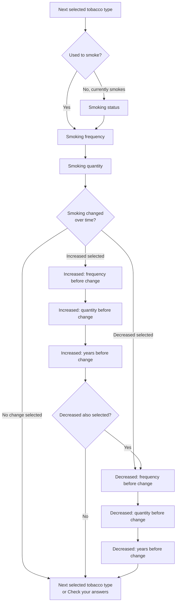

# Prototype v3 question flow

This diagram is based on `app/prototype_v3/routes.js` and `app/prototype_v3/views`.

```mermaid
flowchart TD
  start["Start page<br>/prototype_v3/start-page"] --> signIn["Sign in"]
  signIn --> securityCode["Security code"]
  securityCode --> agreement{"Share NHS login<br>information?"}
  agreement -- Accept --> terms["Accept terms"]
  agreement -- Decline --> agreementDeclined["Sign-in agreement declined<br>End"]

  terms --> phoneQuestionnaire{"Completed the questionnaire<br>by phone?"}
  phoneQuestionnaire -- Yes --> phoneExit["Phone questionnaire exit<br>End"]
  phoneQuestionnaire -- No --> smoker{"Are you a current or<br>former smoker?"}

  smoker -- No or fewer than 100 cigarettes in lifetime --> notEligibleScreening["Not eligible for screening<br>End"]
  smoker -- Yes --> dob{"Date of birth<br>Age 55 to 74?"}

  dob -- No --> notEligibleScan["Not eligible for scan<br>End"]
  dob -- Yes --> faceToFace{"Need a face to face<br>appointment?"}

  faceToFace -- Yes --> bookAppointment["Book appointment<br>End"]
  faceToFace -- No --> height{"Height"}

  height -- Metric --> heightMetric["Height - metric"]
  height -- Imperial --> heightImperial["Height - imperial"]
  heightMetric --> weight
  heightImperial --> weight

  weight{"Weight"} -- Metric --> weightMetric["Weight - metric"]
  weight -- Imperial --> weightImperial["Weight - imperial"]
  weightMetric --> gender["Gender"]
  weightImperial --> gender

  gender --> sex["Sex"]
  sex --> ethnicity["Ethnicity"]
  ethnicity --> education["Education"]
  education --> respiratory["Respiratory conditions"]
  respiratory --> asbestosWork["Asbestos at work"]
  asbestosWork --> asbestosHome["Asbestos at home"]
  asbestosHome --> cancerDiagnosis["Cancer diagnosis"]
  cancerDiagnosis --> relatives{"Close relative had<br>lung cancer?"}

  relatives -- Yes --> relativesAge["Relative diagnosed before 60?"]
  relatives -- No --> ageStarted["Age started smoking"]
  relativesAge --> ageStarted

  ageStarted --> previousSmoker{"Used to smoke?"}
  previousSmoker -- Yes --> ageStopped["Age stopped smoking"]
  previousSmoker -- No, currently smokes --> stoppedSmoking["Periods stopped smoking"]
  ageStopped --> stoppedSmoking
  stoppedSmoking --> smokingType{"Smoking type"}

  smokingType -- One or more tobacco types --> tobaccoLoop["Repeat tobacco questions<br>for each selected type"]

  tobaccoLoop --> cya["Check your answers"]

  cya --> confirmation["Confirmation<br>End"]
```

## Tobacco flow

```mermaid
flowchart TD
  selectedType["Next selected tobacco type"] --> past{"Used to smoke?"}
  past -- No, currently smokes --> status["Smoking status"]
  past -- Yes --> frequency["Smoking frequency"]
  status --> frequency["Smoking frequency"]
  frequency --> quantity["Smoking quantity"]
  quantity --> changed{"Smoking changed<br>over time?"}

  changed -- No change selected --> nextTypeOrCya
  changed -- Increased selected --> increasedFrequency["Increased: frequency before change"]
  increasedFrequency --> increasedQuantity["Increased: quantity before change"]
  increasedQuantity --> increasedYears["Increased: years before change"]
  increasedYears --> decreasedSelected{"Decreased also selected?"}

  changed -- Decreased selected --> decreasedFrequency["Decreased: frequency before change"]
  decreasedSelected -- Yes --> decreasedFrequency
  decreasedSelected -- No --> nextTypeOrCya

  decreasedFrequency --> decreasedQuantity["Decreased: quantity before change"]
  decreasedQuantity --> decreasedYears["Decreased: years before change"]
  decreasedYears --> nextTypeOrCya

  nextTypeOrCya["Next selected tobacco type<br>or Check your answers"]
```
