# Prototype v4.1 question flow

The diagrams use user-facing pages as process rectangles and branch-only routing logic as decision diamonds. Colours are grouped by category: grey for control and flow, blue for process, and green for data.

## Main question flow

```mermaid
flowchart TD
  start([Start]) --> startPage["Start page<br>/prototype_v4_1/start-page"]
  startPage --> signIn["Sign in"]
  signIn --> securityCode["Security code"]
  securityCode --> agreement["Share NHS login<br>information?"]
  agreement --> agreementDecision{"Accepted?"}
  agreementDecision -- Yes --> terms["Accept terms"]
  agreementDecision -- No --> agreementDeclined["Sign-in agreement declined"]
  agreementDeclined --> agreementDeclinedEnd([End])

  terms --> phoneQuestionnaire["Completed the questionnaire<br>by phone?"]
  phoneQuestionnaire --> phoneQuestionnaireDecision{"Completed by phone?"}
  phoneQuestionnaireDecision -- Yes --> phoneExit["Phone questionnaire exit"]
  phoneExit --> phoneExitEnd([End])
  phoneQuestionnaireDecision -- No --> smoker["Are you a current or<br>former smoker?"]

  smoker --> smokerDecision{"Eligible smoker?"}
  smokerDecision -- No or fewer than 100 cigarettes in lifetime --> notEligibleScreening["Not eligible for screening"]
  notEligibleScreening --> notEligibleScreeningEnd([End])
  smokerDecision -- Yes --> dob["Date of birth"]

  dob --> ageDecision{"Age 55 to 74?"}
  ageDecision -- No --> notEligibleScan["Not eligible for scan"]
  notEligibleScan --> notEligibleScanEnd([End])
  ageDecision -- Yes --> faceToFace["Need a face to face<br>appointment?"]

  faceToFace --> faceToFaceDecision{"Needs face-to-face<br>appointment?"}
  faceToFaceDecision -- Yes --> bookAppointment["Book appointment"]
  bookAppointment --> bookAppointmentEnd([End])
  faceToFaceDecision -- No --> heightUnit{"Height unit?"}

  heightUnit -- Metric/default --> heightMetric["Height - metric"]
  heightUnit -- Imperial --> heightImperial["Height - imperial"]
  heightMetric --> weightUnit
  heightImperial --> weightUnit

  weightUnit{"Weight unit?"}
  weightUnit -- Metric/default --> weightMetric["Weight - metric"]
  weightUnit -- Imperial --> weightImperial["Weight - imperial"]
  weightMetric --> gender["Gender"]
  weightImperial --> gender

  gender --> sex["Sex"]
  sex --> ethnicity["Ethnicity"]
  ethnicity --> education["Education"]
  education --> respiratory["Respiratory conditions"]
  respiratory --> asbestosWork["Asbestos at work"]
  asbestosWork --> asbestosHome["Asbestos at home"]
  asbestosHome --> cancerDiagnosis["Cancer diagnosis"]
  cancerDiagnosis --> relatives["Close relative had<br>lung cancer?"]

  relatives --> relativesDecision{"Relative had<br>lung cancer?"}
  relativesDecision -- Yes --> relativesAge["Relative diagnosed before 60?"]
  relativesDecision -- No --> ageStarted["Age started smoking"]
  relativesAge --> ageStarted

  ageStarted --> previousSmoker{"Used to smoke?"}
  previousSmoker -- Yes --> ageStopped["Age stopped smoking"]
  previousSmoker -- No, currently smokes --> stoppedSmoking["Periods stopped smoking"]
  ageStopped --> stoppedSmoking
  stoppedSmoking --> smokingType["Smoking type"]

  smokingType --> smokingTypeDecision{"Any tobacco type<br>selected?"}
  smokingTypeDecision -- No, none selected --> smokingTypeExit["Smoking type exit"]
  smokingTypeExit --> smokingTypeExitEnd([End])
  smokingTypeDecision -- Yes --> tobaccoLoop[["Repeat tobacco questions<br>for each selected type"]]

  tobaccoLoop --> cya["Check your answers"]
  cya --> confirmation
  confirmation@{ shape: doc, label: "Confirmation" }
  confirmation --> flowComplete([End])
  classDef controlFlow fill:#dbe0e3,stroke:#4c6272,color:#212b32,stroke-width:2px
  classDef process fill:#d7e8f7,stroke:#005eb8,color:#212b32,stroke-width:2px
  classDef data fill:#d9f3f0,stroke:#00a499,color:#212b32,stroke-width:2px
  linkStyle default stroke:#4c6272,stroke-width:2px
  class ageDecision,agreementDecision,agreementDeclinedEnd,bookAppointmentEnd,faceToFaceDecision,flowComplete,heightUnit,notEligibleScanEnd,notEligibleScreeningEnd,phoneExitEnd,phoneQuestionnaireDecision,previousSmoker,relativesDecision,smokerDecision,smokingTypeDecision,smokingTypeExitEnd,start,weightUnit controlFlow
  class ageStarted,ageStopped,agreement,agreementDeclined,asbestosHome,asbestosWork,bookAppointment,cancerDiagnosis,cya,dob,education,ethnicity,faceToFace,gender,heightImperial,heightMetric,notEligibleScan,notEligibleScreening,phoneExit,phoneQuestionnaire,relatives,relativesAge,respiratory,securityCode,sex,signIn,smoker,smokingType,smokingTypeExit,startPage,stoppedSmoking,terms,tobaccoLoop,weightImperial,weightMetric process
  class confirmation data
```

### Smoking history subflow

The tobacco questions repeat for each selected tobacco type, in this order:

1. Cigarettes
2. Rolling tobacco
3. Pipes
4. Small cigars
5. Medium cigars
6. Large cigars
7. Cigarillos
8. Shisha

```mermaid
flowchart TD
  selectedType{{Selected tobacco type}} --> pastForYears{"Used to smoke?"}
  pastForYears -- No, currently smokes --> statusBeforeYears["Smoking status"]
  pastForYears -- Yes --> multipleTypes{"More than one<br>tobacco type selected?"}
  statusBeforeYears --> multipleTypes
  multipleTypes -- Yes --> yearsSmoked["Years smoked"]
  multipleTypes -- No --> isShisha{"Is the selected type<br>shisha?"}
  yearsSmoked --> isShisha

  isShisha -- Yes --> shishaPast{"Used to smoke?"}
  shishaPast -- Yes --> setting["Smoking setting"]
  shishaPast -- No, currently smokes --> setting
  setting --> selectedSetting{{Next selected shisha setting}}
  selectedSetting --> shishaFrequency["Smoking frequency"]
  shishaFrequency --> shishaQuantity["Smoking quantity"]
  shishaQuantity --> moreSettings{"More selected<br>shisha settings?"}
  moreSettings -- Yes --> selectedSetting
  moreSettings -- No --> moreTypes

  isShisha -- No --> past{"Used to smoke?"}
  past -- Yes --> frequency["Smoking frequency"]
  past -- No, currently smokes --> frequency["Smoking frequency"]
  frequency --> quantity["Smoking quantity"]
  quantity --> changed["Smoking changed<br>over time?"]

  changed --> changedDecision{"Change selected?"}
  changedDecision -- No change selected --> moreTypes
  changedDecision -- Increased selected --> increasedFrequency["Increased: frequency before change"]
  increasedFrequency --> increasedQuantity["Increased: quantity before change"]
  increasedQuantity --> increasedYears["Increased: years before change"]
  increasedYears --> decreasedSelected{"Decreased also selected?"}

  changedDecision -- Decreased selected --> decreasedFrequency["Decreased: frequency before change"]
  decreasedSelected -- Yes --> decreasedFrequency
  decreasedSelected -- No --> moreTypes

  decreasedFrequency --> decreasedQuantity["Decreased: quantity before change"]
  decreasedQuantity --> decreasedYears["Decreased: years before change"]
  decreasedYears --> moreTypes

  moreTypes{"More selected<br>tobacco types?"}
  moreTypes -- Yes --> nextType((Next type))
  nextType --> selectedType
  moreTypes -- No --> cya((Check your answers))
  classDef controlFlow fill:#dbe0e3,stroke:#4c6272,color:#212b32,stroke-width:2px
  classDef process fill:#d7e8f7,stroke:#005eb8,color:#212b32,stroke-width:2px
  classDef data fill:#d9f3f0,stroke:#00a499,color:#212b32,stroke-width:2px
  linkStyle default stroke:#4c6272,stroke-width:2px
  class changedDecision,cya,decreasedSelected,isShisha,moreSettings,moreTypes,multipleTypes,nextType,past,pastForYears,shishaPast controlFlow
  class changed,decreasedFrequency,decreasedQuantity,decreasedYears,frequency,increasedFrequency,increasedQuantity,increasedYears,quantity,selectedSetting,selectedType,setting,shishaFrequency,shishaQuantity,statusBeforeYears,yearsSmoked process
```

## Symbol key

| Symbol | Mermaid syntax | Used for |
| --- | --- | --- |
| Stadium | `node([Label])` | Start and end points |
| Rectangle | `node["Label"]` | User-facing pages and single process steps |
| Diamond | `node{"Label"}` | Routing decisions |
| Circle | `node((Label))` | Connectors between repeated sections |
| Double-sided rectangle | `node[["Label"]]` | Predefined or repeated sub-processes |
| Hexagon | `node{{"Label"}}` | Preparation steps |
| Document | `node@{ shape: doc, label: "Label" }` | Output documents or reports |

## Notes

- This diagram is based on:
  - `app/prototype_v4_1/routes.js`
  - `app/prototype_v4_1/controllers/authentication.js`
  - `app/prototype_v4_1/controllers/question.js`
- Height and weight unit pages can be switched manually using the unit-switch links.
- `Age stopped smoking` is only asked when the `smoker` answer is `yes_previous`.
- The tobacco subflow uses query strings such as `/prototype_v4_1/smoking-status?type=cigarettes` and `/prototype_v4_1/years-smoked?type=cigarettes`.
- If the `smoker` answer is `yes_previous`, each tobacco type skips `Smoking status` and uses past-tense question text.
- `Years smoked` is shown for each selected tobacco type only when more than one tobacco type has been selected.
- Shisha asks for `Smoking setting`, then repeats frequency and quantity for each selected setting. The shisha setting-specific pages include the setting in the query string, for example `/prototype_v4_1/smoking-frequency?type=shisha&setting=group`.
- If both `increased` and `decreased` are selected for a tobacco type, the flow asks the three "increased" change questions first, then the three "decreased" change questions.
- `Check your answers` links back to the last tobacco step that applies to the current set of answers.
