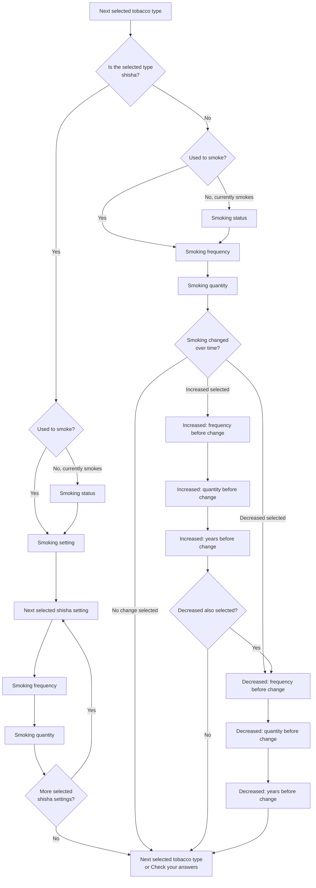

# Prototype v4.1 question flow

This diagram is based on `app/prototype_v4_2/routes.js`, `app/prototype_v4_2/controllers/authentication.js`, and `app/prototype_v4_2/controllers/question.js`.

```mermaid
flowchart TD
  start["Start page<br>/prototype_v4_2/start-page"] --> signIn["Sign in"]
  signIn --> securityCode["Security code"]
  securityCode --> agreement{"Share NHS login<br>information?"}
  agreement -- Accept --> terms["Accept terms"]
  agreement -- Decline --> agreementDeclined["Sign-in agreement declined<br>End"]

  terms --> phoneQuestionnaire{"Completed the questionnaire<br>by phone?"}
  phoneQuestionnaire -- Yes --> phoneExit["Phone questionnaire exit<br>End"]
  phoneQuestionnaire -- No --> smoker{"Are you a current or<br>former smoker?"}

  smoker -- No or fewer than 100 cigarettes in lifetime --> notEligibleScreening["Not eligible for screening<br>End"]
  smoker -- Yes --> dob{"Date of birth<br>Age 55 to 74?"}

  dob -- No --> notEligibleScan["Not eligible for scan<br>End"]
  dob -- Yes --> faceToFace{"Need a face to face<br>appointment?"}

  faceToFace -- Yes --> bookAppointment["Book appointment<br>End"]
  faceToFace -- No --> height{"Height"}

  height -- Metric --> heightMetric["Height - metric"]
  height -- Imperial --> heightImperial["Height - imperial"]
  heightMetric --> weight
  heightImperial --> weight

  weight{"Weight"} -- Metric --> weightMetric["Weight - metric"]
  weight -- Imperial --> weightImperial["Weight - imperial"]
  weightMetric --> aboutYou["About you<br>Gender, sex, ethnicity and education"]
  weightImperial --> aboutYou

  aboutYou --> respiratory["Respiratory conditions"]
  respiratory --> asbestosWork["Asbestos at work"]
  asbestosWork --> asbestosHome["Asbestos at home"]
  asbestosHome --> cancerDiagnosis["Cancer diagnosis"]
  cancerDiagnosis --> relatives{"Close relative had<br>lung cancer?"}

  relatives -- Yes --> relativesAge["Relative diagnosed before 60?"]
  relatives -- No --> ageStarted["Age started smoking"]
  relativesAge --> ageStarted

  ageStarted --> previousSmoker{"Used to smoke?"}
  previousSmoker -- Yes --> ageStopped["Age stopped smoking"]
  previousSmoker -- No, currently smokes --> stoppedSmoking["Periods stopped smoking"]
  ageStopped --> stoppedSmoking
  stoppedSmoking --> smokingType{"Smoking type"}

  smokingType -- None selected --> smokingTypeExit["Smoking type exit<br>End"]
  smokingType -- One or more tobacco types --> tobaccoLoop["Repeat tobacco questions<br>for each selected type"]

  tobaccoLoop --> cya["Check your answers"]
  cya --> confirmation["Confirmation<br>End"]
```

## Tobacco subflow

The tobacco questions repeat for each selected tobacco type, in this order:

1. Cigarettes
2. Rolling tobacco
3. Pipes
4. Small cigars
5. Medium cigars
6. Large cigars
7. Cigarillos
8. Shisha

## Notes

- Height and weight unit pages can be switched manually using the unit-switch links.
- `Age stopped smoking` is only asked when the `smoker` answer is `yes_previous`.
- The tobacco subflow uses query strings such as `/prototype_v4_2/smoking-status?type=cigarettes`.
- If the `smoker` answer is `yes_previous`, each tobacco type skips `Smoking status` and uses past-tense question text.
- Shisha asks for `Smoking setting`, then repeats frequency and quantity for each selected setting. The shisha setting-specific pages include the setting in the query string, for example `/prototype_v4_2/smoking-frequency?type=shisha&setting=group`.
- If both `increased` and `decreased` are selected for a tobacco type, the flow asks the three "increased" change questions first, then the three "decreased" change questions.
- `Check your answers` links back to the last tobacco step that applies to the current set of answers.
