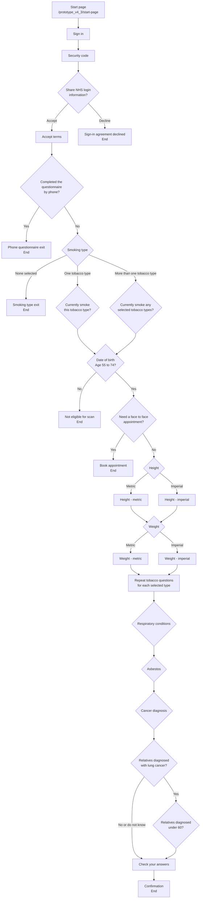
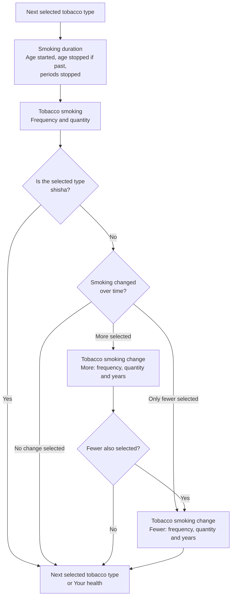

# Prototype v4.3 question flow

This diagram is based on `app/prototype_v4_3/routes.js`, `app/prototype_v4_3/controllers/authentication.js`, and `app/prototype_v4_3/controllers/question.js`.

## Tobacco subflow

The tobacco questions repeat for each selected tobacco type, in this order:

1. Cigarettes
2. Rolling tobacco
3. Pipes
4. Small cigars
5. Medium cigars
6. Large cigars
7. Cigarillos
8. Shisha

## Notes

- Height and weight unit pages can be switched manually using the unit-switch links.
- `Smoking type` is shown immediately after `Phone questionnaire`.
- `Smoking status` is shown when one tobacco type is selected.
- `Smoking status current` is shown when more than one tobacco type is selected. It asks which selected types the user currently smokes.
- `Date of birth`, `Face to face appointment`, `Height` and `Weight` are shown after `Smoking status` or `Smoking status current`.
- `Smoking duration` is part of the tobacco subflow and repeats for each selected tobacco type. It combines age started smoking, age stopped smoking and periods stopped smoking.
- `Age stopped smoking` is shown on `Smoking duration` when the selected tobacco type is past tense.
- `Tobacco smoking` combines smoking frequency and smoking quantity.
- `Tobacco smoking change` combines changed-smoking frequency, quantity and years.
- The tobacco subflow uses query strings such as `/prototype_v4_3/smoking-duration?type=cigarettes` and `/prototype_v4_3/tobacco-smoking-change?type=cigarettes&change=greater`.
- Single-type flows use present tense when `Smoking status` is `yes` and past tense when it is `no`.
- Multi-type flows use present tense for tobacco types selected on `Smoking status current`, and past tense for selected tobacco types not selected on `Smoking status current`.
- Shisha follows the same tobacco-smoking flow as other tobacco types, but skips the smoking-change flow.
- If both `more` and `fewer` are selected for a tobacco type, the flow asks the `more` tobacco-smoking-change page first, then the `fewer` tobacco-smoking-change page.
- The last tobacco step links onward to `Respiratory conditions`.
- `Cancer diagnosis relatives age` is shown only when `Cancer diagnosis relatives` is `yes`.
- `Check your answers` links back to `Cancer diagnosis relatives age` when it was shown, otherwise it links back to `Cancer diagnosis relatives`.
