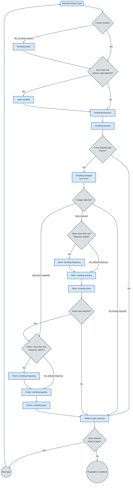

# Prototype v4.4 question flow

The diagrams use user-facing pages as process rectangles and branch-only routing logic as decision diamonds. Colours are grouped by category: grey for control and flow, blue for process, and green for data.

## Main question flow

```mermaid
flowchart TD
  start([Start]) --> startPage["Start page<br>/prototype_v4_4/start-page"]
  startPage --> signIn["Sign in"]
  signIn --> securityCode["Security code"]
  securityCode --> agreement["Share NHS login<br>information?"]
  agreement --> agreementDecision{"Accepted?"}
  agreementDecision -- Yes --> terms["Accept terms"]
  agreementDecision -- No --> agreementDeclined["Sign-in agreement declined"]
  agreementDeclined --> agreementDeclinedEnd([End])

  terms --> phoneQuestionnaire["Completed the questionnaire<br>by phone?"]
  phoneQuestionnaire --> phoneQuestionnaireDecision{"Completed by phone?"}
  phoneQuestionnaireDecision -- Yes --> phoneExit["Phone questionnaire exit"]
  phoneExit --> phoneExitEnd([End])
  phoneQuestionnaireDecision -- No --> smoker["Are you a current or<br>former smoker?"]

  smoker --> smokerDecision{"Eligible smoker?"}
  smokerDecision -- No or fewer than 100 cigarettes in lifetime --> notEligibleScreening["Not eligible for screening"]
  notEligibleScreening --> notEligibleScreeningEnd([End])
  smokerDecision -- Yes --> dob["Date of birth"]

  dob --> ageDecision{"Age 55 to 74?"}
  ageDecision -- No --> notEligibleScan["Not eligible for scan"]
  notEligibleScan --> notEligibleScanEnd([End])
  ageDecision -- Yes --> faceToFace["Need a face to face<br>appointment?"]

  faceToFace --> faceToFaceDecision{"Needs face-to-face<br>appointment?"}
  faceToFaceDecision -- Yes --> bookAppointment["Book appointment"]
  bookAppointment --> bookAppointmentEnd([End])
  faceToFaceDecision -- No --> heightUnit{"Height unit?"}

  heightUnit -- Metric/default --> heightMetric["Height - metric"]
  heightUnit -- Imperial --> heightImperial["Height - imperial"]
  heightMetric --> weightUnit
  heightImperial --> weightUnit

  weightUnit{"Weight unit?"}
  weightUnit -- Metric/default --> weightMetric["Weight - metric"]
  weightUnit -- Imperial --> weightImperial["Weight - imperial"]
  weightMetric --> gender["Gender identity"]
  weightImperial --> gender
  gender --> sex["Sex at birth"]
  sex --> ethnicity["Ethnic background"]
  ethnicity --> education["Education"]

  education --> smokingHistory["Smoking history<br>Interstitial"]
  smokingHistory --> smokingDuration["When you smoked tobacco<br>Age started, age stopped if applicable,<br>periods stopped"]
  smokingDuration --> smokingType["Smoking type"]

  smokingType --> smokingTypeDecision{"Any tobacco type<br>selected?"}
  smokingTypeDecision -- No, none selected --> smokingTypeExit["Smoking type exit"]
  smokingTypeExit --> smokingTypeExitEnd([End])
  smokingTypeDecision -- Yes --> tobaccoLoop[["Repeat tobacco questions<br>for each selected type"]]

  tobaccoLoop --> respiratory["Respiratory conditions"]
  respiratory --> asbestos["Asbestos<br>At work, at home"]
  asbestos --> cancerDiagnosis["Cancer diagnosis"]
  cancerDiagnosis --> relatives["Close relative had<br>lung cancer?"]

  relatives --> relativesDecision{"Relative had<br>lung cancer?"}
  relativesDecision -- Yes --> relativesAge["Relative diagnosed before 60?"]
  relativesDecision -- No --> cya["Check your answers"]
  relativesAge --> cya

  cya --> confirmation
  confirmation@{ shape: doc, label: "Confirmation" }
  confirmation --> flowComplete([End])
  classDef controlFlow fill:#dbe0e3,stroke:#4c6272,color:#212b32,stroke-width:2px
  classDef process fill:#d7e8f7,stroke:#005eb8,color:#212b32,stroke-width:2px
  classDef data fill:#d9f3f0,stroke:#00a499,color:#212b32,stroke-width:2px
  linkStyle default stroke:#4c6272,stroke-width:2px
  class ageDecision,agreementDecision,agreementDeclinedEnd,bookAppointmentEnd,faceToFaceDecision,flowComplete,heightUnit,notEligibleScanEnd,notEligibleScreeningEnd,phoneExitEnd,phoneQuestionnaireDecision,relativesDecision,smokerDecision,smokingTypeDecision,smokingTypeExitEnd,start,weightUnit controlFlow
  class agreement,agreementDeclined,asbestos,bookAppointment,cancerDiagnosis,cya,dob,education,ethnicity,faceToFace,gender,heightImperial,heightMetric,notEligibleScan,notEligibleScreening,phoneExit,phoneQuestionnaire,relatives,relativesAge,respiratory,securityCode,sex,signIn,smoker,smokingDuration,smokingHistory,smokingType,smokingTypeExit,startPage,terms,tobaccoLoop,weightImperial,weightMetric process
  class confirmation data
```

### Smoking history subflow

The tobacco questions repeat for each selected tobacco type, in this order:

1. Cigarettes
2. Rolling tobacco
3. Pipes
4. Small cigars
5. Medium cigars
6. Large cigars
7. Cigarillos
8. Shisha

## Symbol key

| Symbol | Mermaid syntax | Used for |
| --- | --- | --- |
| Stadium | `node([Label])` | Start and end points |
| Rectangle | `node["Label"]` | User-facing pages and single process steps |
| Diamond | `node{"Label"}` | Routing decisions |
| Circle | `node((Label))` | Connectors between repeated sections |
| Double-sided rectangle | `node[["Label"]]` | Predefined or repeated sub-processes |
| Hexagon | `node{{"Label"}}` | Preparation steps |
| Document | `node@{ shape: doc, label: "Label" }` | Output documents or reports |

## Changed-smoking frequency options

Changed-smoking frequency uses the current or usual smoking frequency as a boundary. The question is only shown when there is more than one valid option.

| Current or usual frequency | If smoked more | If smoked fewer or less |
| --- | --- | --- |
| Daily | Default to daily and skip frequency question | Daily, weekly, monthly, yearly |
| Weekly | Daily, weekly | Weekly, monthly, yearly |
| Monthly | Daily, weekly, monthly | Monthly, yearly |
| Yearly | Daily, weekly, monthly, yearly | Default to yearly and skip frequency question |

When the changed-smoking frequency is defaulted, the answer is still stored and shown in summaries, but the frequency row does not include a `Change` link.

## Notes

- This diagram is based on:
  - `app/prototype_v4_4/routes.js`
  - `app/prototype_v4_4/controllers/authentication.js`
  - `app/prototype_v4_4/controllers/question.js`
- Height and weight unit pages can be switched manually using the unit-switch links.
- `Smoking history` is an interstitial page shown after `Education` and before `When you smoked tobacco`.
- `When you smoked tobacco` combines age started smoking, age stopped smoking and periods stopped smoking.
- `Age stopped smoking` is shown on `When you smoked tobacco` when the `smoker` answer is `yes_previous`. It can also be shown again from check your answers if a tobacco-specific `Smoking status` answer is `no`.
- `Years smoked` is shown for each selected tobacco type only when more than one tobacco type has been selected.
- Smoking frequency and smoking quantity are separate pages.
- Changed-smoking quantity and years are separate pages. Changed-smoking frequency is a separate page only when more than one frequency option applies.
- Changed-smoking quantity uses the selected or defaulted changed-smoking frequency to set its `normal day`, `normal week`, `normal month` or `normal year` wording.
- The tobacco subflow uses query strings such as `/prototype_v4_4/smoking-status?type=cigarettes`, `/prototype_v4_4/years-smoked?type=cigarettes` and `/prototype_v4_4/smoking-frequency-change?type=cigarettes&change=greater`.
- If the `smoker` answer is `yes_previous`, each tobacco type skips `Smoking status` and uses past-tense question text.
- Shisha follows the same smoking frequency and quantity flow as other tobacco types, but skips the smoking-change flow.
- If both `more` and `fewer` are selected for a tobacco type, the flow asks the `more` changed-smoking pages first, then the `fewer` changed-smoking pages.
- Each selected tobacco type ends with a scoped summary page before the next selected tobacco type starts.
- `Check your answers` links back to the last tobacco step that applies to the current set of answers.
